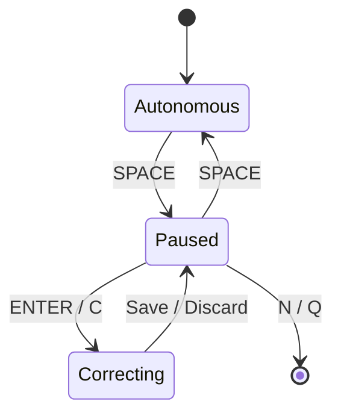

# SmolVLA 원격 서버 + SO-101 HIL 촬영 A–Z

이 문서는 `lerobot806.zip`의 현재 구조와 다음 실제 환경을 기준으로 한다.

- 로봇 PC: SO-101 follower/leader, top·wrist·belly 카메라, GPU 없음
- GPU PC: RTX 3090, `lerobot.async_inference.policy_server`
- 통신: Tailscale, 기본 `100.85.69.64:8080`
- 현재 정책: `eslab1234/smolvla_red_full_138ep_recovery_lora_r64_lr1e3_20k_v1`
- 현재 학습 데이터: `eslab1234/red_full_138ep_recovery_v1`
- 고정 명령: `Pick up the red block and place it in the red target slot.`

## 0. 이번에 사용하는 HIL 방식

저장소에는 공식 `lerobot-rollout --strategy.type=dagger`가 있지만, 해당 경로는 정책을 로봇 PC에서 직접 로드한다. 현재 프로젝트는 무GPU 로봇 PC에서 카메라와 관절을 처리하고 GPU PC에서 SmolVLA를 추론하므로 그대로 사용할 수 없다.

추가한 `smolvla_hil_record.py`는 기존 async policy server를 유지하면서 다음 방식으로 동작한다.



핵심은 **자율주행 구간을 저장하지 않고 사람이 조작한 recovery/correction만 저장**하는 것이다. 일반 `lerobot-train`은 `intervention` 플래그를 보고 자율 오류 행동을 자동 제외하지 않는다. 따라서 모델이 오른쪽으로 빗나간 행동까지 함께 저장하면 그 오류를 다시 모방할 수 있다.

저장되는 각 episode는 다음 의미다.

> 모델이 실제로 만든 실패 상태에서 시작해, 사람이 리더암으로 수행한 깨끗한 복구·교정 구간 1개

카메라와 action feature는 기존 데이터와 동일한 `top/wrist/belly` + 6관절 형식이다. 별도 `intervention` feature를 넣지 않아 기존 138ep 데이터와 바로 병합할 수 있다.

## 1. 추가 파일 설치

패치 ZIP을 LeRobot 루트에 덮어 푼다.

```bash
cd ~/lerobot
unzip ~/다운로드/lerobot806_hil_patch.zip

chmod +x \
  project/scripts/robot/run_smolvla_red_hil_record.sh \
  project/scripts/gpu/merge_smolvla_red_hil_dataset.sh \
  project/scripts/gpu/train_smolvla_red_hil.sh
```

현재 환경이 editable install이면 새 Python 모듈은 즉시 보인다. 확인한다.

```bash
cd ~/lerobot
conda activate lerobot

python -m py_compile \
  src/lerobot/grad_project/recording/smolvla_hil_record.py

python -m lerobot.grad_project.recording.smolvla_hil_record --help | head -40
```

`No module named ...smolvla_hil_record`가 나오면 현재 소스를 다시 editable install 한다.

```bash
cd ~/lerobot
pip install -e .
```

## 2. 시작 전 안전 조건

HIL은 정책과 사람이 같은 episode에서 제어권을 주고받으므로 일반 추론보다 handover 안전이 중요하다.

1. follower 전원, leader 전원, 카메라 3대, 비상정지를 먼저 확인한다.
2. `SPACE`를 누른 직후에는 **리더암에서 손을 뗀다**. follower를 즉시 현재 측정 자세로 고정한 뒤 leader가 약 1.2초 동안 follower 자세로 자동 정렬된다.
3. `[PAUSED] leader aligned+locked` 로그가 뜨기 전에 leader를 잡지 않는다.
4. correction 도중 너무 빠르게 leader를 움직이지 않는다. follower에는 기존 synchronized step clamp와 tracking watchdog가 그대로 적용된다.
5. `Q`, `ESC`, `Ctrl+C` 종료는 현재 미저장 correction을 폐기하고 자동 observe 복귀를 하지 않는다. 충돌 상황에서 임의의 자동 이동을 막기 위한 동작이다.
6. 로봇 측 HIL 스크립트는 키 입력이 필요하므로 `nohup`, 백그라운드 `&`, stdin pipe로 실행하지 않는다. SSH를 써도 foreground TTY에서 실행해야 한다.

## 3. GPU PC에서 policy server 시작

GPU PC 터미널 1:

```bash
cd ~/lerobot
conda activate lerobot

bash project/scripts/gpu/run_smolvla_red_policy_server.sh
```

다음 로그를 확인한다.

```text
PolicyServer started on 0.0.0.0:8080
```

모델 경로는 로봇 client가 전달한다. HIL 첫 실험에서는 서버를 새로 시작해 이전 세션의 큐 상태를 없애는 편이 좋다.

## 4. 로봇 PC에서 첫 HIL 세션 시작

로봇 PC 터미널:

```bash
cd ~/lerobot
conda activate lerobot

MODEL_PATH="eslab1234/smolvla_red_full_138ep_recovery_lora_r64_lr1e3_20k_v1" \
DATASET_NAME="red_smolvla_hil_corrections_r1" \
NUM_CORRECTIONS=20 \
bash project/scripts/robot/run_smolvla_red_hil_record.sh
```

스크립트가 실제 repo id 뒤에 시간을 붙인다. 예:

```text
[HIL DATASET] actual repo_id=eslab1234/red_smolvla_hil_corrections_r1_20260806_190000
```

이 **정확한 전체 ID를 복사해 둔다.** 이후 검증·병합에 사용한다.

기본 주요 값은 다음과 같다.

| 항목 | 기본값 | 의미 |
| --- | ---: | --- |
| `NUM_CORRECTIONS` | 20 | 이번 세션에서 새로 저장할 사람 교정 episode 수 |
| `MAX_CORRECTION_SECONDS` | 30 | 교정 1개의 최대 시간; 초과 시 자동 폐기 |
| `ACTIONS_PER_CHUNK` | 30 | 현재 SmolVLA 자율 추론 청크 |
| `CHUNK_SIZE_THRESHOLD` | 0.6 | 다음 관측 전송 기준 |
| `AGGREGATE_FN_NAME` | `latest_only` | 새 청크 우선 |
| `SERVER_RPC_TIMEOUT_S` | 3.0 | handover 시 server queue flush 대기 상한 |
| `MAX_RELATIVE_TARGET` | 3.0 | follower 명령 벡터의 step clamp |
| `MAX_TRACKING_ERROR` | 20.0 | tracking watchdog 기준 |

첫 화면에서 `HIL`을 입력한 뒤, observe 자동복귀와 scene 준비 안내를 따른다. 블록 배치가 끝나면 Enter를 눌러 자율 추론을 시작한다.

## 5. 실제 키와 한 번의 HIL 흐름

| 상태 | 키 | 동작 |
| --- | --- | --- |
| Autonomous | `SPACE` | 정책 큐 폐기, follower 즉시 hold, leader 자동 정렬, Paused 진입 |
| Paused | `Enter` 또는 `C` | leader torque 해제, 사람 제어 및 correction 녹화 시작 |
| Correcting | `→` | 현재 사람 교정 구간을 episode 1개로 저장하고 Paused |
| Correcting | `←` | 현재 교정 프레임과 임시 영상을 완전 폐기하고 Paused |
| Paused | `SPACE` | 현재 로봇 상태에서 새 관측으로 정책 재개 |
| Paused/Autonomous | `N` | 현재 physical trial 종료, observe 복귀 후 다음 블록 배치 |
| 모든 상태 | `Q` 또는 `ESC` | 전체 종료, 미저장 교정 폐기, 자동복귀 없음 |

### 권장 순서 A: 사람이 끝까지 완료

1. Enter로 자율 정책 시작.
2. 모델이 명확히 잘못된 방향으로 가거나 잘못 집으려는 순간 `SPACE`.
3. follower가 멈추고 leader 자동 정렬이 끝날 때까지 손을 뗀다.
4. `[PAUSED]` 확인 후 `Enter`.
5. 현재 실패 상태에서 사람이 recovery와 올바른 pick/place를 끝까지 수행한다.
6. 블록을 슬롯에 놓고 gripper를 완전히 연 채 0.5~1초 정지한다.
7. `→`로 저장한다.
8. 작업이 끝났으므로 `N`; observe 복귀 후 다음 배치를 준비한다.

### 권장 순서 B: 짧게 교정하고 정책에 다시 넘김

1. `SPACE` → leader 정렬 → `Enter`.
2. 사람이 로봇을 다시 올바른 접근 자세까지 복구하고 짧고 확실한 교정을 수행한다.
3. `→`로 사람 교정 구간을 저장한다.
4. Paused에서 `SPACE`를 눌러 같은 physical trial의 현재 상태부터 정책을 다시 실행한다.
5. 다시 틀리면 위 과정을 반복한다. 한 physical trial 안에서 correction episode가 여러 개 생길 수 있다.

### 저장하면 안 되는 경우

- 사람이 correction 중에도 블록을 놓침
- leader 조작이 심하게 머뭇거리거나 왕복함
- 손으로 블록을 옮겨 장면이 순간이동함
- 충돌 또는 tracking watchdog가 발생함
- 이미 복구 불가능한 상태인데 억지로 이어감

이때는 `←`로 폐기한다. 물체를 손으로 재배치해야 한다면 `←` → `N` → observe 복귀 후 다음 trial에서 다시 시작한다. **녹화 중 손으로 물체를 옮기면 안 된다.**

## 6. 첫 HIL 20개 촬영 구성

현재 가설은 B/G 정면 각도 데이터가 상대적으로 부족해 그 범위에서 shoulder pan 방향 결정이 약하다는 것이다. 첫 round는 성공 장면을 무작정 더 찍지 말고 현재 모델의 실패 분포를 직접 겨냥한다.

| 교정 수 | 시작 분포 | 목표 |
| ---: | --- | --- |
| 6 | B의 정면 각도 범위 | 오른쪽 편향이 보이는 실제 실패 상태에서 정확한 중심 접근 |
| 6 | G 중앙 정면 범위 | 정면 shoulder-pan 결정과 수직 하강 교정 |
| 4 | B/G 경계 및 약간 좌·우 변형 | 특정 한 점 암기 방지 |
| 4 | 접근은 맞지만 파지각·gripper·release 실패 | 파지/놓기 recovery 보강 |

모든 trial에는 평가처럼 5개 블록을 두고 distractor 배치를 바꾼다. 단, 빨간 블록 위치를 이번 목표 분포에 놓는다.

좋은 개입 시점은 “실패가 명확해졌지만 아직 충돌·블록 밀기처럼 복구 불가능한 결과가 나기 전”이다. 정책이 올바르게 수행한 trial은 개입하지 말고 `N`으로 넘긴다. HIL의 목적은 성공 수집이 아니라 **정책이 방문한 실패 상태에 전문가 행동을 붙이는 것**이다.

## 7. 중단 후 같은 HIL 데이터셋에 이어 찍기

처음 출력된 시간 포함 repo id를 그대로 지정한다. `NUM_CORRECTIONS`는 전체 목표가 아니라 **이번 실행에서 추가할 수**다.

```bash
cd ~/lerobot
conda activate lerobot

DATASET_REPO_ID="eslab1234/red_smolvla_hil_corrections_r1_20260806_190000" \
RESUME=true \
NUM_CORRECTIONS=10 \
bash project/scripts/robot/run_smolvla_red_hil_record.sh
```

## 8. HIL 데이터 검증

GPU PC 또는 데이터가 캐시된 PC:

```bash
conda activate lerobot

HIL_DATASET="eslab1234/red_smolvla_hil_corrections_r1_20260806_190000"

lerobot-edit-dataset \
  --repo_id="$HIL_DATASET" \
  --operation.type=info \
  --operation.show_features=true
```

반드시 확인할 항목:

- FPS 30
- episode 수가 저장한 correction 수와 같음
- `observation.images.top`, `wrist`, `belly` 3개
- action/state 6차원과 기존 데이터의 joint name 순서가 같음
- task 문장이 기존 학습과 글자 단위로 동일함
- 영상 시작이 모델 실패 상태이고, 이후 행동은 사람이 한 깨끗한 correction임
- 자동 observe 복귀와 leader 정렬 장면은 영상에 없음

Hub 업로드 후 LeRobot dataset visualizer에서도 모든 episode를 한 번씩 본다. 실패 correction이 저장되어 있으면 학습 전에 episode를 제거하거나 새 HIL 세션으로 다시 찍는다.

## 9. 기존 138ep + HIL 병합

HIL correction은 보통 기존 end-to-end episode보다 짧다. 단순히 20개를 한 번 합치면 frame 비율이 너무 작을 수 있으므로 첫 round는 HIL 데이터를 3회 반복해 병합한다. 원본과 HIL 저장소는 수정되지 않는다.

GPU PC:

```bash
cd ~/lerobot
conda activate lerobot

HIL_DATASET="eslab1234/red_smolvla_hil_corrections_r1_20260806_190000" \
HIL_REPEAT=3 \
MERGED_DATASET="eslab1234/red_full_138ep_recovery_hil_r1_v1" \
bash project/scripts/gpu/merge_smolvla_red_hil_dataset.sh
```

기본 base는 다음이다.

```text
eslab1234/red_full_138ep_recovery_v1
```

다른 base를 쓸 경우 명시한다.

```bash
BASE_DATASET="eslab1234/정확한_base_dataset" \
HIL_DATASET="eslab1234/정확한_hil_dataset" \
MERGED_DATASET="eslab1234/새_merged_dataset" \
bash project/scripts/gpu/merge_smolvla_red_hil_dataset.sh
```

출력 폴더가 이미 있으면 스크립트는 덮어쓰지 않고 중단한다. 새 `MERGED_DATASET` 이름을 사용한다.

## 10. 현재 LoRA 모델에서 HIL round 1 추가 학습

기존 LoRA를 처음부터 버리지 않고 현재 138ep 모델 adapter를 이어 학습한다. 첫 HIL round 기본값은 10k steps, peak LR `3e-4`, warmup 500이다. 기존 `1e-3`보다 보수적인 이유는 소량의 반복 correction이 원래 잘하던 위치까지 덮어쓰는 것을 줄이기 위해서다.

GPU PC foreground 실행:

```bash
cd ~/lerobot
conda activate lerobot

TRAIN_DATASET="eslab1234/red_full_138ep_recovery_hil_r1_v1" \
CURRENT_MODEL="eslab1234/smolvla_red_full_138ep_recovery_lora_r64_lr1e3_20k_v1" \
RUN_NAME="smolvla_red_hil_r1_lora_r64_lr3e4_10k_v1" \
bash project/scripts/gpu/train_smolvla_red_hil.sh
```

SSH가 끊겨도 학습을 유지하려면 GPU PC에서 다음처럼 실행한다.

```bash
cd ~/lerobot
conda activate lerobot
mkdir -p logs

nohup env \
  TRAIN_DATASET="eslab1234/red_full_138ep_recovery_hil_r1_v1" \
  CURRENT_MODEL="eslab1234/smolvla_red_full_138ep_recovery_lora_r64_lr1e3_20k_v1" \
  RUN_NAME="smolvla_red_hil_r1_lora_r64_lr3e4_10k_v1" \
  bash project/scripts/gpu/train_smolvla_red_hil.sh \
  > logs/hil_r1_launcher.log 2>&1 &

echo $!
```

확인:

```bash
tail -f logs/hil_r1_launcher.log
nvidia-smi
```

학습 스크립트는 현재 소스 버전에 맞게 transform 3개를 하나의 `--dataset.image_transforms.tfs` JSON으로 전달한다. 예전에 오류가 난 개별 `...brightness.weight` 형식은 사용하지 않는다.

## 11. 새 모델 추론 및 비교 평가

학습 완료 모델:

```text
eslab1234/smolvla_red_hil_r1_lora_r64_lr3e4_10k_v1
```

GPU policy server를 재시작한 다음 로봇 PC에서 기존 안전 추론 스크립트에 모델만 바꾼다.

```bash
cd ~/lerobot
conda activate lerobot

MODEL_PATH="eslab1234/smolvla_red_hil_r1_lora_r64_lr3e4_10k_v1" \
ACTIONS_PER_CHUNK=30 \
CHUNK_SIZE_THRESHOLD=0.6 \
AGGREGATE_FN_NAME=latest_only \
bash project/scripts/robot/run_smolvla_red_observe_inference.sh
```

HIL 효과는 HIL에 쓴 장면을 그대로 반복하는 것만으로 판단하면 안 된다. 다음 두 평가를 분리한다.

1. **타깃 평가:** HIL에 쓰지 않은 B/G 정면 위치에서 10~20회. 접근 방향·파지 성공률 비교.
2. **회귀 평가:** 기존에 잘하던 D/E/F/H 등에서 10~20회. 성공률이 떨어지지 않았는지 확인.

비교할 항목:

- 빨간 블록 방향 접근 성공
- 중심 오차(오른쪽/왼쪽, 대략 cm)
- grasp 성공
- target slot release 성공
- 전체 성공
- 충돌/안전정지
- 완료 시간

새 모델이 B/G는 좋아졌지만 기존 구역이 나빠졌다면 우선 순서는 다음과 같다.

1. `HIL_REPEAT=3`을 2로 낮춰 다시 병합·학습
2. steps를 10k보다 늘리기 전에 HIL correction 품질 재검사
3. 동일한 실패 장면을 지나치게 반복했는지 확인
4. 원래 잘하던 구역의 소수 rehearsal episode를 유지

## 12. 자주 발생하는 문제

### `Policy server is not reachable`

GPU PC에서 server가 먼저 실행되어야 한다. Tailscale IP와 8080 포트를 확인한다.

```bash
tailscale status
ss -ltnp | grep 8080
```

### `observation.images.top` 또는 `camera1` KeyError

HIL 데이터 feature는 반드시 `top/wrist/belly`로 기록한다. 이 스크립트는 그렇게 고정되어 있다. GPU server의 checkpoint preprocessor가 `camera1/2/3`으로 rename한다. HIL launcher의 camera key를 임의로 `camera1/2/3`으로 바꾸지 않는다.

### `SPACE`가 동작하지 않음

로봇 측 터미널에 포커스를 두고 foreground로 실행한다. `nohup`, IDE output pane, stdin redirection에서는 키를 받을 수 없다.

### leader가 handover 때 튐

이 구현은 현재 leader 위치를 먼저 goal로 쓴 뒤 torque를 켜고 follower로 보간한다. 그래도 튄다면 즉시 종료하고 follower/leader calibration ID와 기구적 영점을 확인한다. handover 시간도 늘릴 수 있다.

```bash
LEADER_HANDOVER_DURATION_S=2.0 \
bash project/scripts/robot/run_smolvla_red_hil_record.sh
```

### correction 저장 후 모델이 예전 행동을 잠깐 실행함

resume 시 local queue와 server observation queue를 모두 비우고, resume 이전 timestamp의 action chunk 전체를 폐기한다. 이 로그가 반복되거나 동작이 의심스러우면 양쪽 프로세스를 모두 종료하고 policy server부터 새로 시작한다.

### tracking watchdog 정지

해당 correction은 저장하지 않는다. leader를 더 천천히 움직이고 기구적 걸림, 케이블, gripper overload를 확인한다. 단순히 watchdog 값을 크게 올리는 것으로 해결하지 않는다.

### merge feature mismatch

다음을 base와 HIL 각각 실행해 feature를 비교한다.

```bash
lerobot-edit-dataset --repo_id="eslab1234/base" --operation.type=info --operation.show_features=true
lerobot-edit-dataset --repo_id="eslab1234/hil"  --operation.type=info --operation.show_features=true
```

특히 FPS, robot type, `top/wrist/belly`, action/state names가 같아야 한다.

## 13. 졸업과제 최종 평가와의 구분

HIL은 **학습 데이터 수집 방법**이다. 최종 평가 중 사람이 `SPACE`로 개입하거나 leader로 수정하면 자율 수행 평가가 아니므로 최종 데모에서는 HIL recorder를 사용하지 않는다. 최종 평가에는 일반 inference client만 사용한다.

첨부된 최신 `졸업과제 세부사항_v2.0` 기준으로 Task 1은 다음 조건을 별도로 재현해 평가해야 한다.

- 배부된 4cm × 4cm × 2cm 블록 5개
- 평가자가 초기 위치를 무작위 배치
- 지정 구역 내부 20cm × 10cm, 경계선 최대 2cm
- 제한시간 3분
- 성공 여부와 완료 시간 측정
- Jetson Orin Nano가 평가 서버와 통신
- 평가 서버에는 미리 준비한 Docker 이미지로 즉시 환경 구성

따라서 지금의 HIL round와 별개로, 마지막에는 `Jetson → 평가 GPU 서버` 통신·Docker 이식 시험과 3분 무개입 end-to-end 평가를 반드시 수행해야 한다.

## 14. 한 줄 실행 순서 요약

1. GPU: `run_smolvla_red_policy_server.sh`
2. Robot: `run_smolvla_red_hil_record.sh`
3. HIL 영상 전수검사
4. GPU: `merge_smolvla_red_hil_dataset.sh`
5. GPU: `train_smolvla_red_hil.sh`
6. 새 모델 무개입 B/G 타깃 평가
7. 기존 구역 회귀 평가
8. 필요하면 HIL round 2 반복
